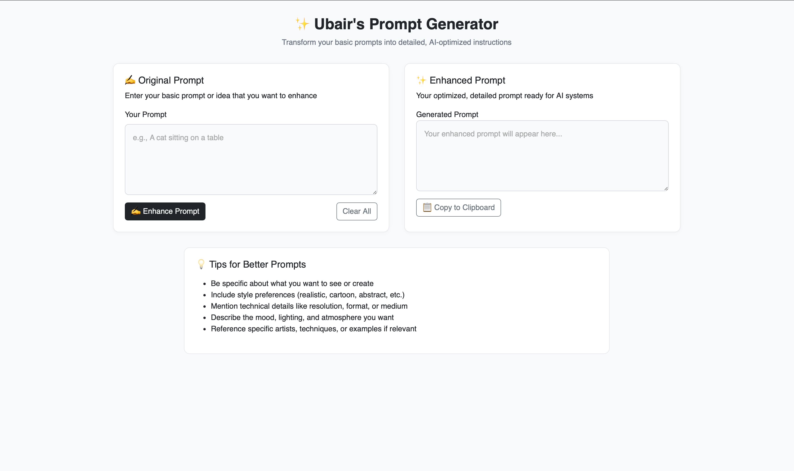

### 🧠 Ubair's AI Prompt Generator

Transform simple ideas into rich, detailed prompts using AI — powered by OpenRouter's DeepSeek R1 API.

This Flask-based web app provides a beautiful, responsive interface for users to input basic ideas and instantly receive enhanced, AI-optimized prompts based on a custom structure.

Check it out on render (might take some time to boot up cos free plan 🥲 )-:

(https://ubair-s-ai-prompt-generator.onrender.com)
---

### 🚀 Features

* 🖊 User-friendly Bootstrap UI
* ⚙️ Custom prompt formatting in backend
* 🤖 Integrated with OpenRouter (DeepSeek R1)
* 📋 Copy-to-clipboard functionality
* 💡 Tip section to guide users

### 📸 Snapshots



### 🛠 Setup Instructions

1. **Clone the repo**

   ```bash
   git clone https://github.com/ubairrr/Ubair-s-AI-Prompt-Generator.git
   cd Ubair-s-AI-Prompt-Generator
   ```

2. **Install dependencies**

   ```bash
   pip install -r requirements.txt
   ```

3. **Add your API key**
   Create a `.env` file in the root:

   ```
   OPENROUTER_API_KEY=your_api_key_here
   ```

4. **Run the app**

   ```bash
   python app.py
   ```
